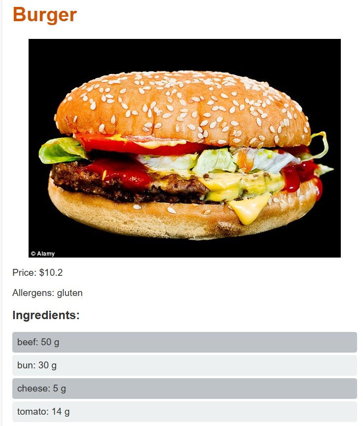

# RestaurantTakeOut
## Steps to Run the Node.js Code

### 1. Configure the .env File
- Create a `.env` file in your project's root directory.
- Add AWS credentials, JWT secret, and any other necessary environment variables. Example format:

- Ensure the `.env` file is included in your `.gitignore` to avoid uploading it to GitHub.

### 2. Install Node.js Modules
- If not already installed, download and install Node.js from the [official website](https://nodejs.org/).
- In your project directory, open a terminal and run `npm install`. This will install modules as follows: `dotenv`, `express`, `googleapis`, `jsonwebtoken`, `mysql`, and `mysql2`.

### 3. Run the Server
- Start the server by running `node server.js` in the terminal.
- The server should now be running, accessible at `http://localhost:3000`.

### 4. Testing APIs with Postman
- Use Postman to test your API endpoints.
- Configure requests with the correct URL, headers, and request body as needed.
- Send requests to your server to test its responses.
- You can use postman collection to efficiently test the apis. Send us an email.

### 5. Testing APIs on browser
- Only manager use cases can be tested in the browser
- Testable apis in the browser as follows:
    - employeeSignin
    - employeeSignup
    - menuUpload
    - generateUploadURL (used for uploading image on AWS S3)
    - getMenuItemDetails
    - fetchImage

### 6. Understanding the Authentication Mechanism
- The application uses JSON Web Tokens (JWT) for authentication. For instance, the /signin endpoint generates a JWT token as a response.
- Some APIs such as `fetchEmployee` require this token in the authentication header. When sending a request to these APIs, include the token value as needed.